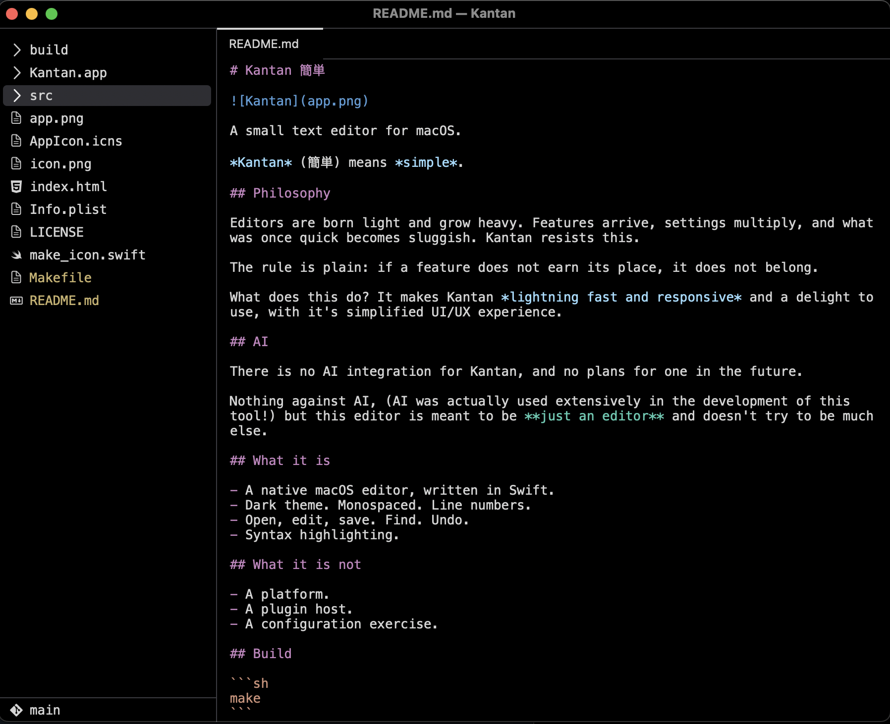

# Kantan 簡単



A small text editor for macOS.

*Kantan* (簡単) means *simple*.

## Philosophy

Editors are born light and grow heavy. Features arrive, settings multiply, and what was once quick becomes sluggish. Kantan resists this.

The rule is plain: if a feature does not earn its place, it does not belong.

What does this do? It makes Kantan *lightning fast and responsive* and a delight to use, with it's simplified UI/UX experience.

## AI

There is no AI integration for Kantan, and no plans for one in the future.

Nothing against AI, (AI was actually used extensively in the development of this tool!) but this editor is meant to be **just an editor** and doesn't try to be much else.

## What it is

- A native macOS editor, written in Swift.
- Dark theme. Monospaced. Line numbers.
- Open, edit, save. Find. Undo.
- Syntax highlighting.

## What it is not

- A platform.
- A plugin host.
- A configuration exercise.

## Build

```sh
make
```

## Run

```sh
make run
```

## Source

Entry point: `main.swift`.
